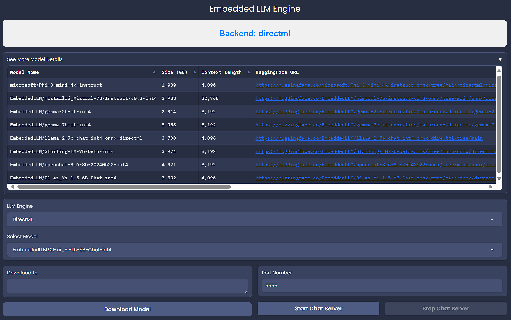

# EmbeddedLLM

Run local LLMs on iGPU, APU and CPU (AMD , Intel, and Qualcomm (Coming Soon)). Easiest way to launch OpenAI API Compatible Server on Windows, Linux and MacOS

| Support matrix        | Supported now                                       | Under Development | On the roadmap |
| --------------------- | --------------------------------------------------- | ----------------- | -------------- |
| Model architectures   | Gemma <br/> Llama \* <br/> Mistral + <br/>Phi <br/> |                   |                |
| Platform              | Linux <br/> Windows                                 |                   |                |
| Architecture          | x86 <br/> x64 <br/>                                 | Arm64             |                |
| Hardware Acceleration | CUDA<br/>DirectML<br/>                              | QNN <br/> ROCm    | OpenVINO       |

\* The Llama model architecture supports similar model families such as CodeLlama, Vicuna, Yi, and more.

\+ The Mistral model architecture supports similar model families such as Zephyr.

## 🚀 Latest News

- [2024/06] Support Phi-3 (mini, small, medium), Phi-3-Vision-Mini, Llama-2, Llama-3, Gemma (v1), Mistral v0.3, Starling-LM, Yi-1.5.
- [2024/06] Support vision/chat inference on iGPU, APU, CPU and CUDA.

## Supported Models (Quick Start)

| Models | Parameters | Context Length | Link |
| --- | --- | --- | --- |
| Gemma-2b-Instruct v1 | 2B | 8192 | [EmbeddedLLM/gemma-2b-it-onnx](https://huggingface.co/EmbeddedLLM/gemma-2b-it-onnx) |
| Llama-2-7b-chat | 7B | 4096 | [EmbeddedLLM/llama-2-7b-chat-int4-onnx-directml](https://huggingface.co/EmbeddedLLM/llama-2-7b-chat-int4-onnx-directml) |
| Llama-2-13b-chat | 13B | 4096 | [EmbeddedLLM/llama-2-13b-chat-int4-onnx-directml](https://huggingface.co/EmbeddedLLM/llama-2-13b-chat-int4-onnx-directml) |
| Llama-3-8b-chat | 8B | 8192 | [EmbeddedLLM/mistral-7b-instruct-v0.3-onnx](https://huggingface.co/EmbeddedLLM/mistral-7b-instruct-v0.3-onnx) |
| Mistral-7b-v0.3-instruct | 7B | 32768 | [EmbeddedLLM/mistral-7b-instruct-v0.3-onnx](https://huggingface.co/EmbeddedLLM/mistral-7b-instruct-v0.3-onnx) |
| Phi-3-mini-4k-instruct-062024 | 3.8B | 4096 | [EmbeddedLLM/Phi-3-mini-4k-instruct-062024-onnx](https://huggingface.co/EmbeddedLLM/Phi-3-mini-4k-instruct-062024-onnx/tree/main/onnx/directml/Phi-3-mini-4k-instruct-062024-int4) |
| Phi3-mini-4k-instruct | 3.8B | 4096 | [microsoft/Phi-3-mini-4k-instruct-onnx](https://huggingface.co/microsoft/Phi-3-mini-4k-instruct-onnx) |
| Phi3-mini-128k-instruct | 3.8B | 128k | [microsoft/Phi-3-mini-128k-instruct-onnx](https://huggingface.co/microsoft/Phi-3-mini-128k-instruct-onnx) |
| Phi3-medium-4k-instruct | 17B | 4096 | [microsoft/Phi-3-medium-4k-instruct-onnx-directml](https://huggingface.co/microsoft/Phi-3-medium-4k-instruct-onnx-directml) |
| Phi3-medium-128k-instruct | 17B | 128k | [microsoft/Phi-3-medium-128k-instruct-onnx-directml](https://huggingface.co/microsoft/Phi-3-medium-128k-instruct-onnx-directml) |
| Openchat-3.6-8b | 8B | 8192 | [EmbeddedLLM/openchat-3.6-8b-20240522-onnx](https://huggingface.co/EmbeddedLLM/openchat-3.6-8b-20240522-onnx) |
| Yi-1.5-6b-chat | 6B | 32k | [EmbeddedLLM/01-ai_Yi-1.5-6B-Chat-onnx](https://huggingface.co/EmbeddedLLM/01-ai_Yi-1.5-6B-Chat-onnx) |
| Phi-3-vision-128k-instruct |  | 128k | [EmbeddedLLM/Phi-3-vision-128k-instruct-onnx](https://huggingface.co/EmbeddedLLM/Phi-3-vision-128k-instruct-onnx/tree/main/onnx/cpu_and_mobile/cpu-int4-rtn-block-32-acc-level-4) |

## Getting Started

### Installation

#### From Source

**Windows**

1. **XPU**: Requires anaconda environment. `conda create -n ellm python=3.10 libuv; conda activate llm`.

2. Install embeddedllm package. `$env:ELLM_TARGET_DEVICE='directml'; pip install -e .`. Note: currently support `cpu`, `directml` and `cuda`.
   - **DirectML:** `$env:ELLM_TARGET_DEVICE='directml'; pip install -e .[directml]`
   - **CPU:** `$env:ELLM_TARGET_DEVICE='cpu'; pip install -e .[cpu]`
   - **CUDA:** `$env:ELLM_TARGET_DEVICE='cuda'; pip install -e .[cuda]`
   - **XPU:** `$env:ELLM_TARGET_DEVICE='xpu'; pip install -e .[xpu]`
   - **With Web UI**:
     - **DirectML:** `$env:ELLM_TARGET_DEVICE='directml'; pip install -e .[directml, webui]`
     - **CPU:** `$env:ELLM_TARGET_DEVICE='cpu'; pip install -e .[cpu, webui]`
     - **CUDA:** `$env:ELLM_TARGET_DEVICE='cuda'; pip install -e .[cuda, webui]`

**Linux**

1. **XPU**: Requires anaconda environment. `conda create -n ellm python=3.10 libuv; conda activate llm`.

2. Install embeddedllm package. `ELLM_TARGET_DEVICE='directml' pip install -e .`. Note: currently support `cpu`, `directml` and `cuda`.
   - **DirectML:** `ELLM_TARGET_DEVICE='directml' pip install -e .[directml]`
   - **CPU:** `ELLM_TARGET_DEVICE='cpu' pip install -e .[cpu]`
   - **CUDA:** `ELLM_TARGET_DEVICE='cuda' pip install -e .[cuda]`
   - **With Web UI**:
     - **DirectML:** `ELLM_TARGET_DEVICE='directml' pip install -e .[directml, webui]`
     - **CPU:** `ELLM_TARGET_DEVICE='cpu' pip install -e .[cpu, webui]`
     - **CUDA:** `ELLM_TARGET_DEVICE='cuda' pip install -e .[cuda, webui]`

**Note**

1. If you are using Conda Environment. Install additional dependencies: `conda install conda-forge::vs2015_runtime`.

### Launch OpenAI API Compatible Server

```
usage: ellm_server.exe [-h] [--port int] [--host str] [--response_role str] [--uvicorn_log_level str]
                       [--served_model_name str] [--model_path str] [--vision bool]

options:
  -h, --help            show this help message and exit
  --port int            Server port. (default: 6979)
  --host str            Server host. (default: 0.0.0.0)
  --response_role str   Server response role. (default: assistant)
  --uvicorn_log_level str
                        Uvicorn logging level. `debug`, `info`, `trace`, `warning`, `critical` (default: info)
  --served_model_name str
                        Model name. (default: phi3-mini-int4)
  --model_path str      Path to model weights. (required)
  --vision bool         Enable vision capability, only if model supports vision input. (default: False)
```

1. `ellm_server --model_path <path/to/model/weight>`.
2. Example code to connect to the api server can be found in `scripts/python`.

## Launch Chatbot Web UI

1. `ellm_chatbot --port 7788 --host localhost --server_port <ellm_server_port> --server_host localhost`.


## Launch Model Management UI

It is an interface that allows you to download and deploy OpenAI API compatible server. You can find out the disk space required to download the model in the UI.

1. `ellm_modelui --port 6678`



## Compile OpenAI-API Compatible Server into Windows Executable

1. Install `embeddedllm`.
2. Install PyInstaller: `pip install pyinstaller`.
3. Compile Windows Executable: `pyinstaller .\ellm_api_server.spec`.
4. You can find the executable in the `dist\ellm_api_server`.

## Acknowledgements

- Excellent open-source projects: [vLLM](https://github.com/vllm-project/vllm.git), [onnxruntime-genai](https://github.com/microsoft/onnxruntime-genai.git) and many others.
